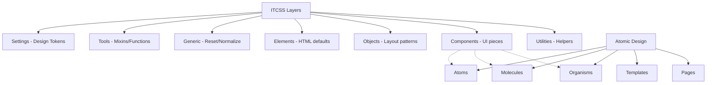
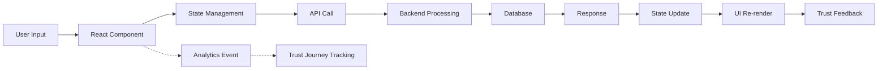

# Design System Architecture

```mermaid
graph TD
    A[ITCSS Layers] --> B[Settings - Design Tokens]
    A --> C[Tools - Mixins/Functions]
    A --> D[Generic - Reset/Normalize]
    A --> E[Elements - HTML defaults]
    A --> F[Objects - Layout patterns]
    A --> G[Components - UI pieces]
    A --> H[Utilities - Helpers]

    I[Atomic Design] --> J[Atoms]
    I --> K[Molecules]
    I --> L[Organisms]
    I --> M[Templates]
    I --> N[Pages]

    G -.-> J
    G -.-> K
    G -.-> L
```

> Диаграмма показывает связь слоёв ITCSS и уровней Atomic Design, применяемых в проекте. 

## Data Flow

```mermaid
graph LR
    A[User Input] --> B[React Component]
    B --> C[State Management]
    C --> D[API Call]
    D --> E[Backend Processing]
    E --> F[Database]

    F --> G[Response]
    G --> H[State Update]
    H --> I[UI Re-render]
    I --> J[Trust Feedback]

    B -.-> K[Analytics Event]
    K -.-> L[Trust Journey Tracking]
```